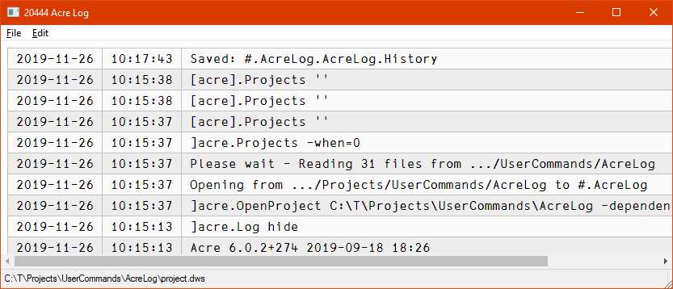

# AcreLog

This user command puts acre's log file onto a GUI. 

If you don't use [acre](https://github.com/the-carlisle-group/Acre-Desktop "acre on GitHub") there is no point in having this user command.

acre uses an ordinary editor window in order to put its log on display. That can be annoying for a number of reasons. `]AcreLog` gets you around this by displaying the log in a GUI instead.

`]AcreLog` uses HTMLRenderer and therefore requires at least version 17.0 of Dyalog APL.

Notes:

* AcreLog saves the position and size of the window in the Windows Registry, therefore after a restart the window appears on the same spot with the same size it had when it was closed.

* For updating the GUI a trigger function (rather than a timer) is used in order to avoid getting into the programmer's way when she is tracing code.

* acre restricts the number of entries to a maximum of thousand entries, therefore that's the maximum of lines displayed by AcreLog.

* The WSID displayed in the status bar will be updated once a new log entry arrives.

* Whenever the GUI is updated it is brought to the front. That is important when you work on two projects in two different APL sessions: no matter which one is active, once the GUI is updated the right one is brought to the front.

* The caption of the GUI shows the process ID of the APL the GUI is associated with.